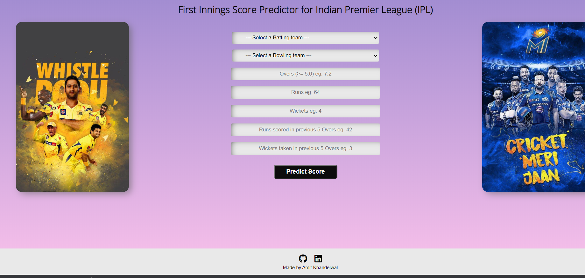

# IPL-FIRST-INNINGS-SCORE-PREDICTOR-DEPLOYMENT

<h2>Demo Link :</h2>https://ipl-score-pred.herokuapp.com/

<h2>Problem Statement</h2>

Build a model which predict the score(in terms of range) of the first innings batting Team of any Ipl Match.

<h2>Dateset :</h2>

The dataset 'ipl.csv' consists of ball-to-ball informations about every match of IPL from Season 1 to 10 ie: (2008 to 2017)

Dataset consists following columns:

• mid: Unique match id.

• date: Date on which the match was played.

• venue: Stadium where match was played.

• bat_team: Batting team name.

• bowl_team: Bowling team name.

• batsman: Batsman who faced that particular ball.

• bowler: Bowler who bowled that particular ball.

• runs: Runs scored by team till that point of instance.

• wickets: Number of Wickets fallen of the team till that point of instance.

• overs: Number of Overs bowled till that point of instance.

• runs_last_5: Runs scored in previous 5 overs.

• wickets_last_5: Number of Wickets that fell in previous 5 overs.

• striker: max(runs scored by striker, runs scored by non-striker).

• non-striker: min(runs scored by striker, runs scored by non-striker).

• total: Total runs scored by batting team at the end of first innings.

<h2>Algorithms Used :</h2>

• Linear Regression

• Ridge Regression

• Random Forest Regressor

• XGBoost Regressor
